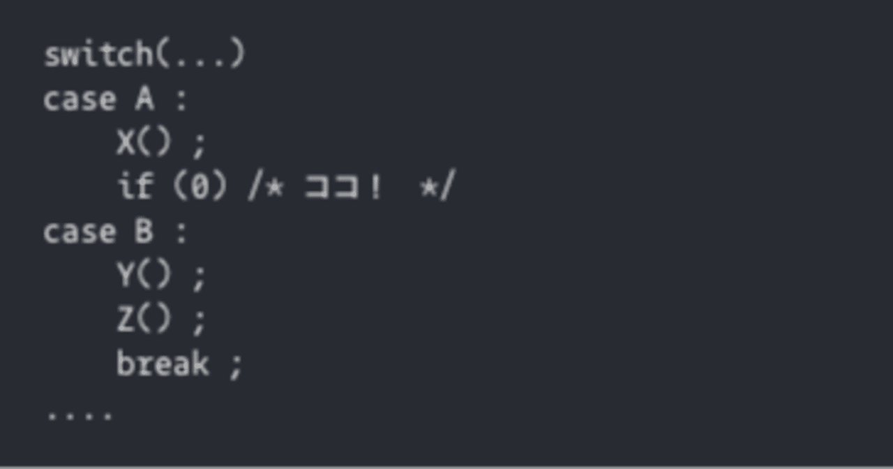

# ソフトウェア開発201の鉄則 原理87:コーディング:トリックを使うな

## 要旨 

* 知性をひけらかそうとして、小難しい「トリッキーな」コードを書くプログラマーが多い
* しかし、それは単なる自己満足にすぎない、何も賢くない、ばかげたことである
* なので、決して「トリッキーな」プログラムを作るな
* スマートさは、トリックを避けて「オーソドックスな」コードを書くことで示しなさい

## 解説

人は誰しも、「自分を良く見せたい」「評価されたい」という自己肯定感、承認欲求というものを持っている。そのこと自体は、人が持つ欲求の一つなので何ら問題はない。ただ、そのやり方の良し悪し、というのは、ある。

確かに、ソフトウェアのエンジニアは、それなりの知性を持っていないと務まらない。そして、プログラマー自身もそのことを意識し、高い知性を持っていることを周囲に知らしめたくなるかもしれない。

で、その表現方法として、

他人が思いつかないようなトリックを使う。
そして、他人が思いつかなかったことを自分が出来たことに優越感を見出す。

経験の浅い、いや、ベテランでも視点の狭い、いわゆる「井の中の蛙」として過ごしたエンジニアによく見受けられるシーン。

自分がこれまでに一番びっくりしたトリックは、これ。C 言語のswich文の処理で、
case A : 処理 X->Z
case B : 処理 Y->Z 
のコードを、このように書いたもの。

switch(...)
case A : 
    X() ;
    if (0) /* ココ！　*/
case B : 
    Y() ;
    Z() ;
    break ;
....
case A内の if (0)が、トリック。確かに、その次のY() は絶対に実行されないから、確かに所望の通り正しく実行されば、する。

ただ、このコードを見て、Aの時とBの時に何が処理されるか、パッとわかりますか？

switch(...)
case A : 
    X() ;
    Z() ;
    break ;
case B : 
    Y() ;
    Z() ;
    break ;
....
素直に、こう書けばいいものを。

Z() を二回か着たくないとか、行数を縮めたかったとか。気持ちはわからなくはないが、自己満足以外の何物でも、ない。

経験を積めば、そして視点を広げて周囲を見回せば、賢いことを示すためにはこんなトリックは何にも役に立たず、後者のような、誰にでもわかりやすいコードを書くことの方がずっと寄与することに、すぐに気づくはずだ。

