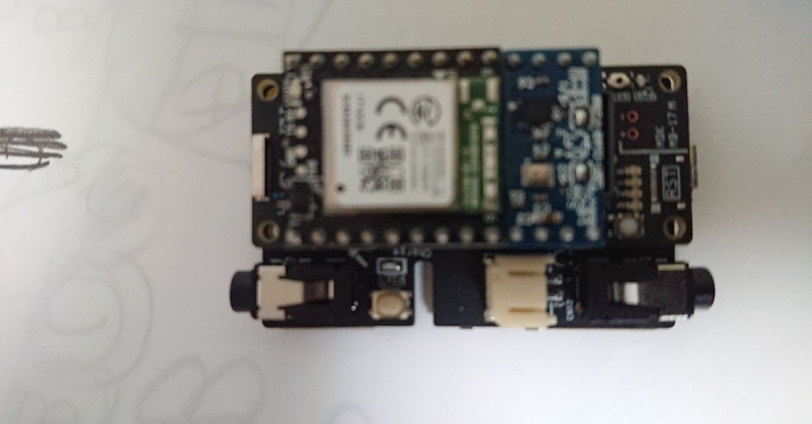

# ソフトウェア開発201の鉄則 原理172:管理:プロジェクトの事後検討会（反省会）を実施せよ

## 要旨

* プロジェクトには必ず問題（課題）がある
* プロジェクト終了後に、事後検討会を必ずやりなさい
* 目的は、期間中に起きた問題=うまくいかなかったことを分析しそこから学びを得ること
* この活動は、必ず将来のプロジェクトに多大な恩恵をもたらす

## 解説

いわゆる「振り返り」のこと。今でこそ、ソフトウェア開発での区切りで振り返りをやるプロジェクトは多くなったが、その必要性を1990年代に出版された書籍で30年も前に唱えていたことになる。この書籍に凄さは、ここにある。

振り返りのやり方は、多くの情報源がある。その中でも、KPT(Keep/Problem/Try) 形式のものが、シンプルながら効果が大きい。

KPTは、Keep で「上手く言ったこと」Problemで「上手くいかなかったこと」Try で「Pに対する施策」を挙げてメンバで議論し共有する、それだけ。

もちろん、進め方にコツは、ある。よくあるのは、Problemで恨み辛みをあげつらったり、個人攻撃になること。KPTで挙げるのは「自分のこと」が基本。人のことは、該当者が素直に挙げれば良い.... と言ったやり方は、ネットに多数情報があるので、そちらを参照すべし。

昔から「失敗は成功の母」と言う。ソフトウェア開発も同じで、とあるプロジェクトの中での問題＝失敗は、今後のプロジェクトで二度と起きないとか、そこから得た教訓を元により効率的になれば、結果として「成功」と言えよう。

