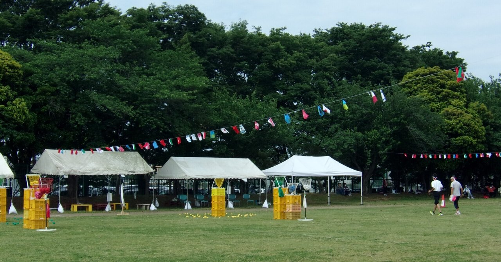
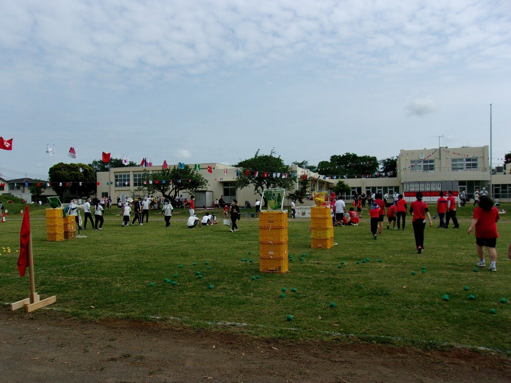

# 父親のPTA活動奮闘記 Vol #2 ~ 黒一点

紅一点の反対語。あまりポピュラーな言葉ではないようだ。PTA活動は、典型的な「黒一点」の世界。

高校生になって以来三十年以上、男が圧倒的に多い集団で過ごしてきた。男が圧倒的に多い進学校で男子クラス。大学は工学部。そしてメーカーで研究開発部門。もう圧倒的に男性が多い環境で、職場なんかは男60人に秘書さん一人なんてこともあった。

PTAの集団は、それが一気に、逆。初の会合に行ったら、ママさん40人くらいに、男性は自分と、PTA会長（なぜか会長は男性なんですね）の、二人だけ。

ママさんは気さくな方が多く、愛想よく挨拶たり声かけてくれたおかげで、足を踏み入れた瞬間の緊張は解けたんだけど、もう、五感に感じる全てが、経験したことのない、何か。

特に、耳に聞こえる音。もう、耳につくというか、やかましいと言うか。

断っておく。
別にママさんや女性がやかましい、と言いたいのでは「決して、ない」。単に、「自分が聞いたことのない音声」なので耳についた、ということだ。

この三十年聴き慣れてきた音声とは、周波数特性が明らかに違う。

最近流行りのディープラーニングでの異常検知に「オートエンコーダー」というものがある。正常な状態をインプットして特徴を掴んだ上で、新たな入力がその特徴に近ければ正常、遠ければ「異常」と判断するもの。

    
[

Autoencoderを使った異常検知を解説！実際の活用事例も紹介 | TRYETING Inc.（トライエッティング）

企業などの生産活動において異常検知をする必要ある場面は多々あります。今回は異常検知の導入を検討している方に向けて、Auto

www.tryeting.jp

](https://www.tryeting.jp/column/627/)

 
   三十年間、オレの頭には、男中心の音声の周波数特性が「正常な状態」としてインプットされ続けている。

なので、PTAのママさんの集団の声は、「余の学習データにございません」って感じ、もう常に異常状態。
聞いてるだけで、いや聞かなくても、頭がクラクラ。会った瞬間の
「久しぶり〜元気〜」から終わらない、アレ。(以下略)

