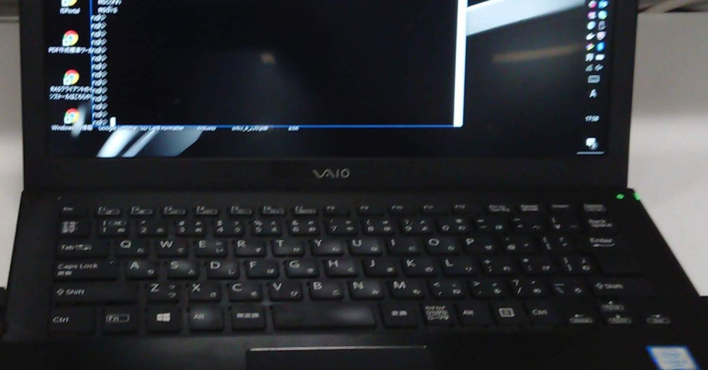

# 父親のPTA活動奮闘記 Vol #3 ~ ママさんのパソコン操作

PTA活動は、年に二度の会報作成と発行をやる「会報委員」の副委員長で始まった。ママさんメインのPTA活動で、自分の居所とか立ち位置あるんかな、と、ものすごく不安に思ってのスタートだったが、全くもって杞憂だった。それは、一瞬で決まった。

諸々のパソコン作業。

失礼な言い草なんだけど、ママさんたち、いわゆる「パソコン音痴」だらけ。断っておくが、決してけなしたり、バカにしているいる訳では、ない。普段使わないんだから、仕方ない。

おれは一応エンジニアで、業務で一日十時間くらいパソコンの前にいるので
出来てフツー。

会報の作業は、想像つく通り、文章作成とか印刷会社とのやりとりとかで
たくさんのパソコン作業がある。

そのほぼ全てが、自分にとっては全くなんてことない文章作成とか表作成なので、どんどんこなしていったら、もうそれだけで注目の的になった。

そして、紙面一面に配置する学校のURLを埋め込んだQRコードを作成したら、もうみんな、ひっくり返った。

かくして程なく、オレはPTA活動のヒーローになった。単にフツーにWindows PCを操作して、Microsoft Office系のソフトウェアを扱ってるだけ、で。

表計算ソフト Microsoft Excelで、「オートフィル」という機能がある。1,2 とセルを埋めて　ビヨーーン　とひっぱたら 3,4,5 と連番が埋まる、アレ。その手の効率アップ的技を駆使して表を作成していたら、背後から

「すご〜い」

なんて声があちらこちらから。

        そして、なんかイヤな予感がしたので振り返ったら、オレのパソコン操作のスマホでの動画撮影会が始まってた。

流石に、これは、やめてください、と丁重にお断りした。操作方法の動画、いくらでもあるので、動画撮影意味ないし。

ママさんたちのパソコンスキル、結局は自分がPTA活動してた三年間ずっと、悩みの種の一つであり続けた。

