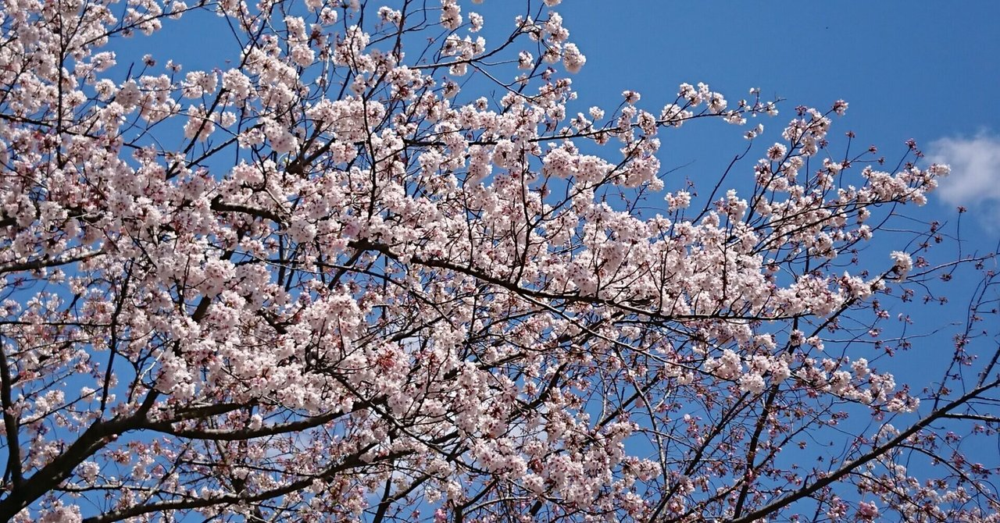
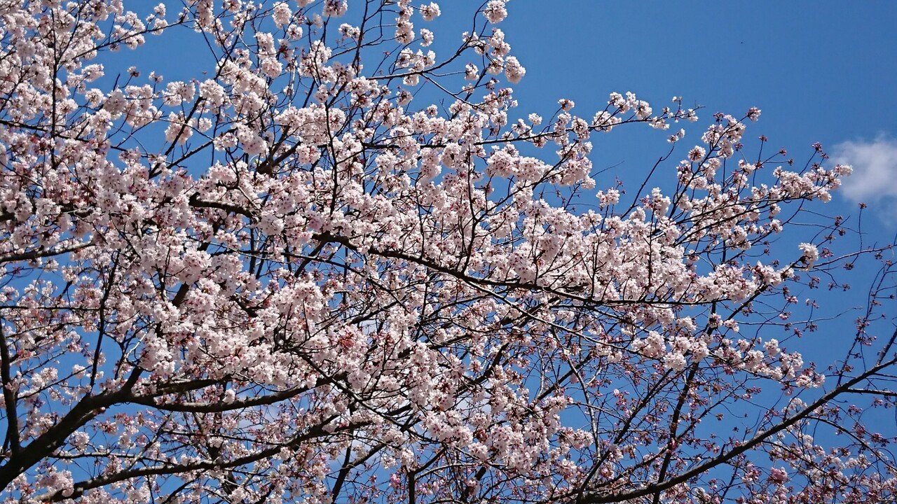

# 父親のPTA活動奮闘記 ~ はじめに

卒業した。長男が高校を。同時に、父親のオレがPTA活動を。

三年前。訳あって、ヤツの高校のPTA活動を勤めざるを得なくなった。ヤツが中学校を卒業するまで、授業参観や面談、学校の行事には積極的に参加していたけど、PTAだけは、逃げ回ってていた。

そりゃそうだろう。そもそもママさんの世界だし。そのママさんだって疲弊するくらいの面倒臭い世界らしいし。とにかく、いい話を聞いたことがない。だから、ヤツの高校でやらざるを得なくなった時は、ホンマに戦々恐々だった。

先に言ってしまうと、気さくなママさんが多くいて、親切にしてくれたおかげで、そんなにイヤなことはほとんどなく、三年間それなりにPTA活動は楽しめた。ただ、やっぱり、オレの想定にない、理解できないことは、たくさん起きた。それも「人生勉強」と言えるのかもしれないが、ママさん自体が、その理解できないことに苦悶しているシーンを何度も見かけたりして、
やっぱり、「いい話聞かない」だけの世界だったように思う。

そんな、三年間のPTA活動で起きたり知ったり気づいたりしたことをあれこれ、書いてみたい。

多分、こんな話になる。

1. 黒一点(紅一点の反対）の世界
2. パソコン音痴
3. 「紙に手書き」の世界
4. 先輩ママさん
5. PTAの人間関係

シリーズ、頑張って書いてみます。

三年前、その高校の入学式で撮影した写真。

