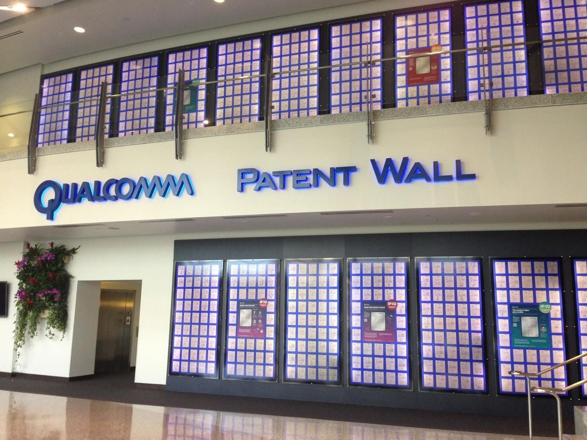
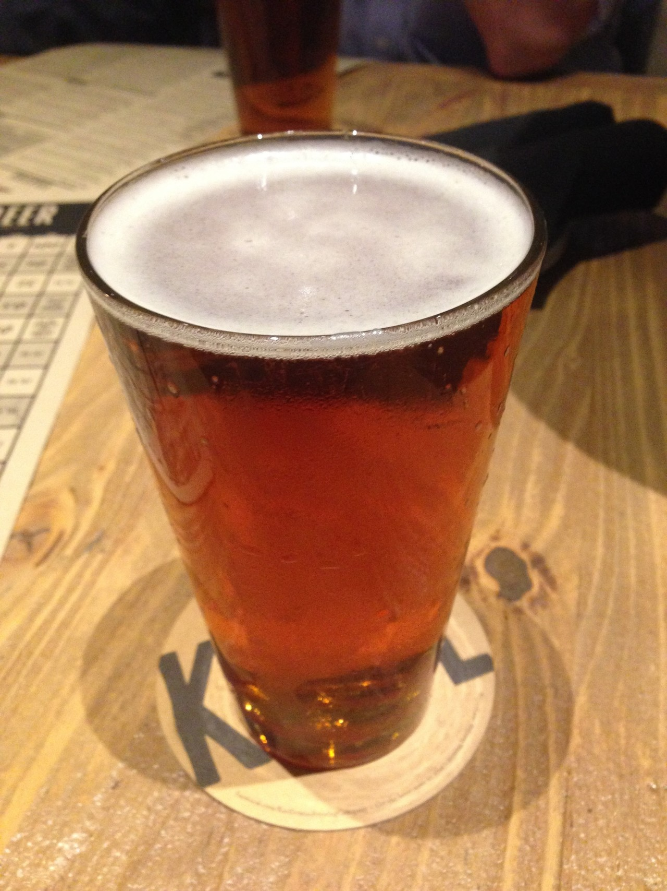
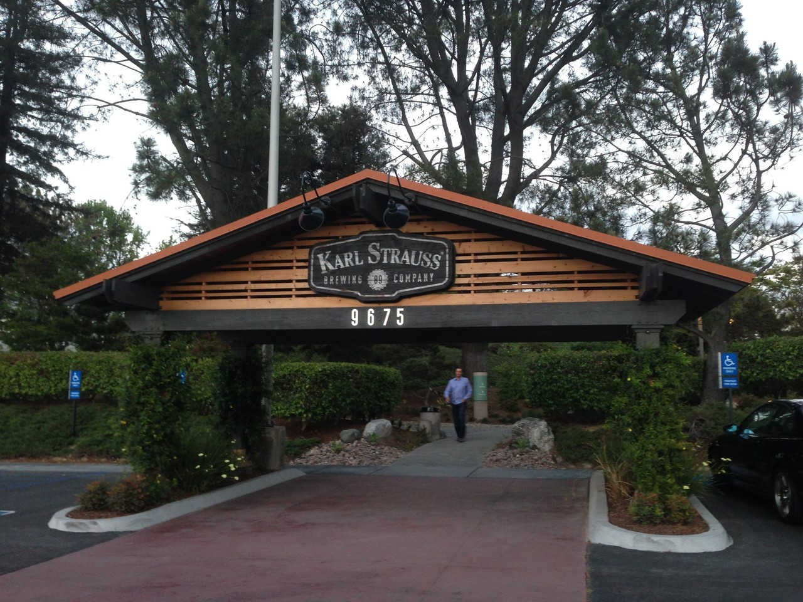

# [海外渡航・第23回] San Diego / U.S.A (2015年3月29日〜4月4日)

何事も、やり続けるって大変ですね。note の投稿はその最たるものかもしれない。少しだけですが、書きます。

海外渡航の備忘録を日付が新しい順に作成中。今回は３年前の、巨大半導体ベンダーへの出張、３年ぶりの海外、そして10年ぶりの西海岸。

## San Diego って

スポーツなら、MLBだとパドレス。NFAだとチャージャーズ。あまり強い印象ないですけど。

そして、地図で見るとわかりますが、20キロほど行くと、メキシコ。トムクルーズの映画「トップガン」のロケ地でも有名。

## Patent Wall

その、巨大半導体ベンダー。特許を稼ぎ頭とするビジネス戦略を象徴するかのような、1500個あまりもある特許広報をずらっと並べた「壁」。

ちなみに、用事は、協業での技術開発。もちろん詳細は言えない。

## クラフトビールの聖地

San Diego はそう呼ばれるらしい。その通り。いやー美味かった。いくつも有名なブリュワリーやブリュワリー直営のレストランがあるので、行くべし。私は、その巨大半導体ベンダーの領地のすぐそばにある「Kari Strauss」へ。

IPA が美味い。多分、カラッとした気候もビールの美味さを演出する要素なのだろう。

## おまけ : 予定外の一泊

帰りはLos Angeles 経由での予定だったのが、San Diego -> Los Angeles のコミューター便とかいう便が大遅延で国際便に搭乗できず。人生初の「帰国できず」（笑）

