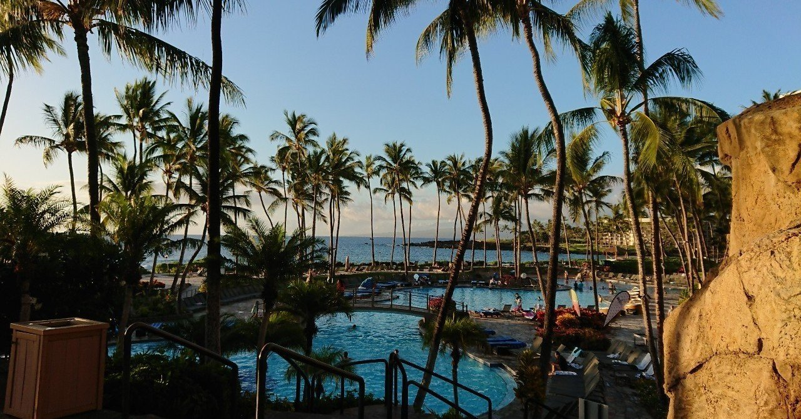
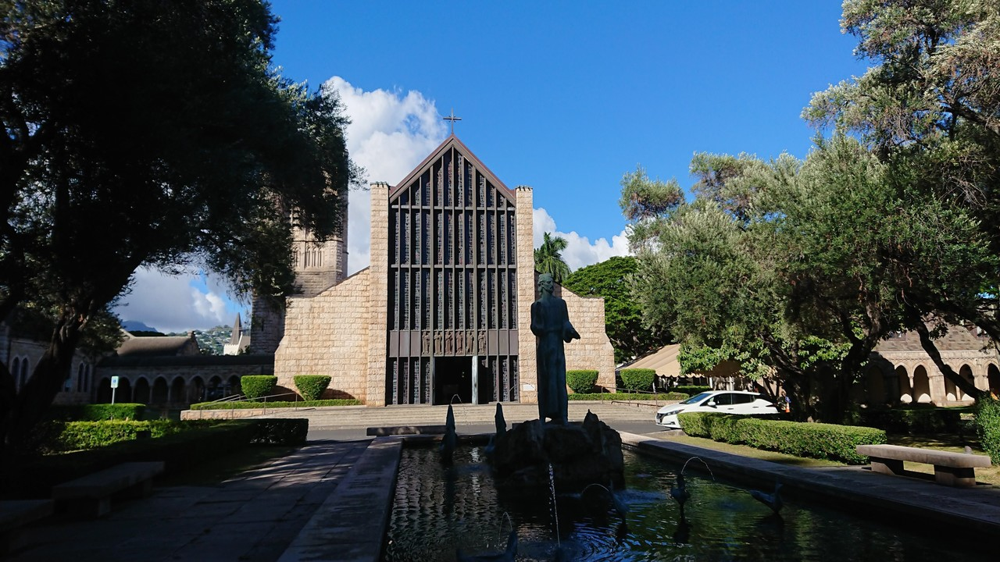
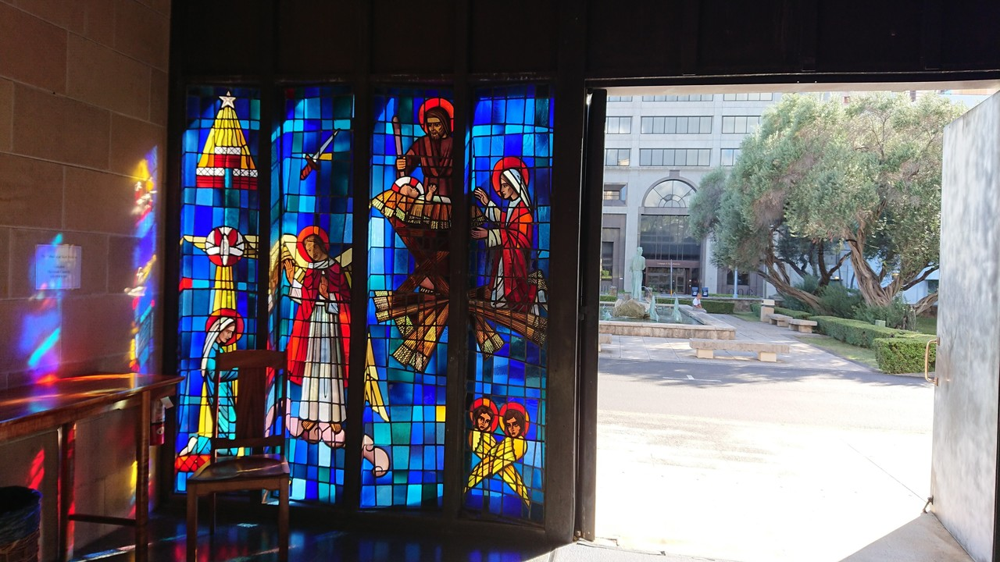
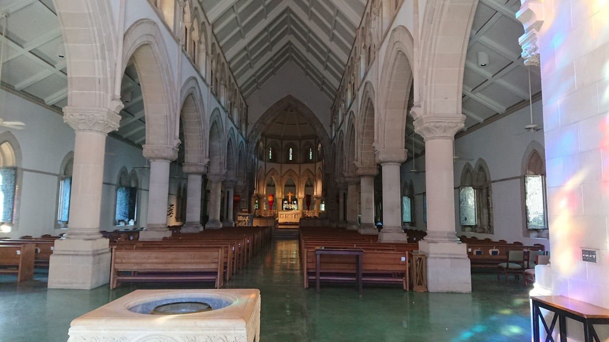
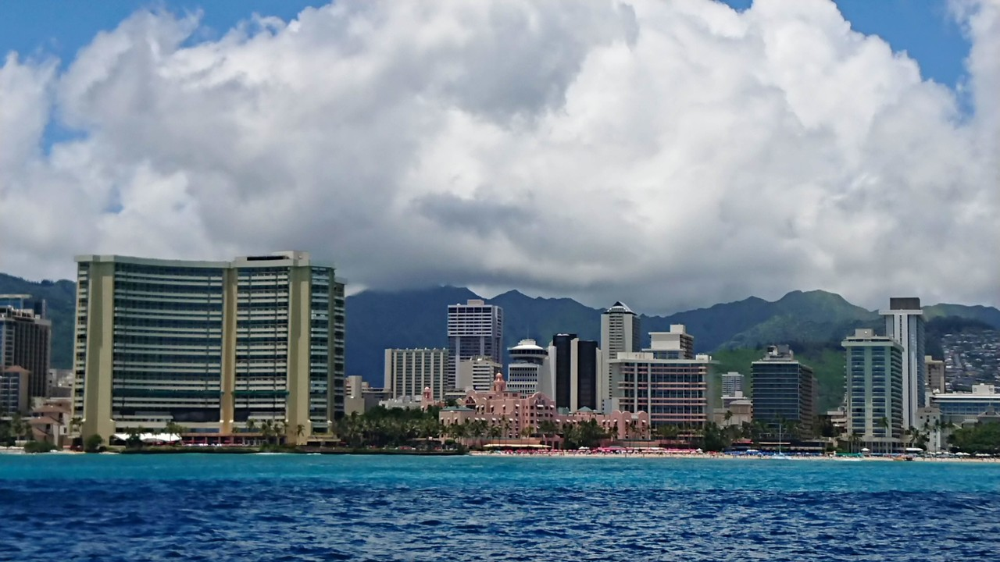
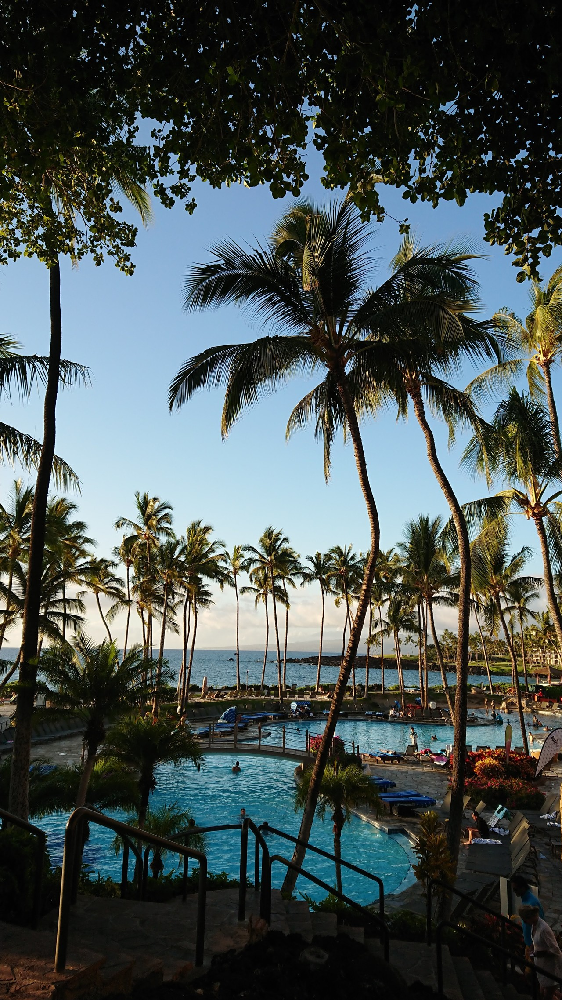
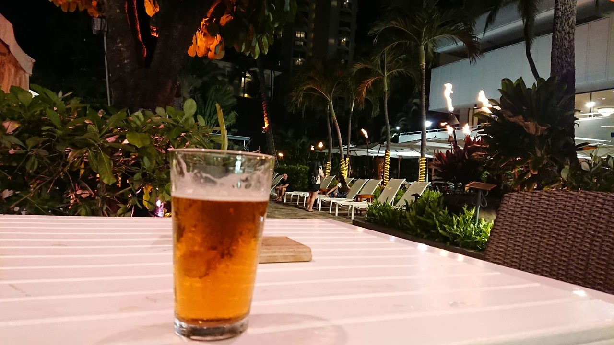
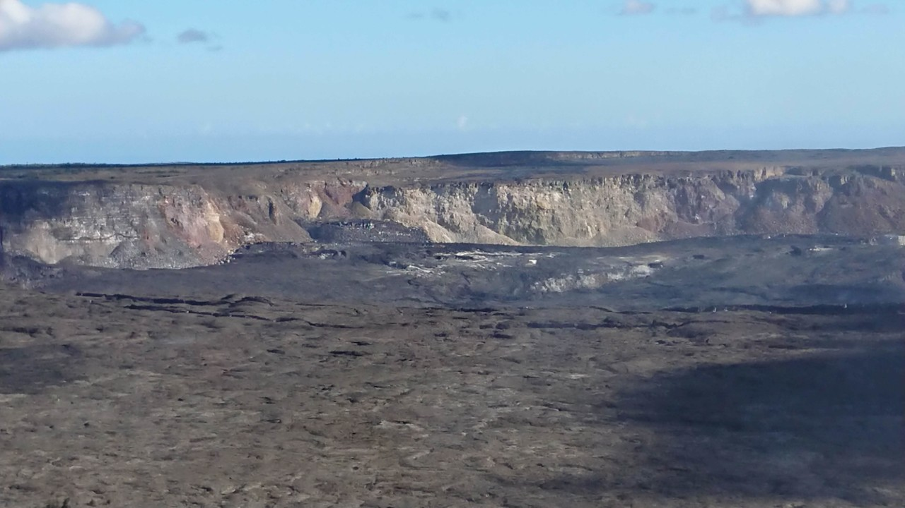
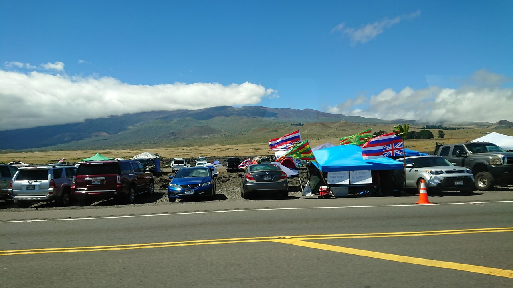

# [海外渡航・第24回] Hawaii / USA (2019年7月25日〜7月31日)

結婚20周年を機に、結婚式を挙げたハワイに。もう一度式を挙げた大聖堂を訪れたいというのと、20年前には存在さえしなかった息子たちに外国を体験 させたい、というのが動機。

5泊7日、まぁ書ききれないくらい、言いたいことてんこ盛りだったのですが、旅行記みたいなのはまた別途として、差し当たり「素敵」３つと、「残念」３つ。

## 素敵！

1. セント・アンドリュース教会 (St. Andrew's Cathedral)

ここで結婚式を挙げました。毎年様相が変化し、昔の跡形もないとタクシー運転手に言われたホノルルの街で、ここだけは20年前と同じ、静かで落ち着いた雰囲気のままでした。

このステンドグラスが有名。

この祭壇で20年前ひざまづいてたわけです。

2. 色彩！

抜けるような青い空。透き通った青い海。南国らしいヤシの木の緑。そして眩しい光。目に入ってくる映像すべてが、普段見ることのない色彩や感覚。

写真で見るとうまく伝わらないけど、ありがちなワイキキの光景でさえ、目に入ってきて色彩の感覚がこれまでにないものな感じがする。

これも、そう。

3. ビール！

特に、IPA (Indian Pale Ale)が最高。暑いけど湿度がそんなに高くない、フツーに過ごしていたら自然とビールを欲したくなるような気候がビールの美味さを演出してるのでしょうね。そして、物価が恐ろしく高い中、なぜかビールだけはそこそこ安いんですよね。

## 残念！

1. キラウエア、マグマ噴いてない 
昨年までは、グツグツ煮立った真っ赤なマグマが見られたそうだけど、水蒸気爆発ですべて全部住宅地経由で海に流れちゃって、今は何もない。活火山の荒々しい光景は観れたけど。

2. マウナケア、頂上に登れない！

新しい天文台の建設に反対する地元ハワイアンのデモ隊が、山頂への道を封鎖していてツアーは全滅なんだそうな。

この山がマウナケア。手前の車やテントがデモ隊。これがずーっと３００メーターくらい続いてる。

もっとも、山麓２０００メーターくらいのところでも、素敵な星空が見れたのでいいけど。

3. 食事、高いわ！
いくらリゾート地とはいえ。朝食40ドルはないやろ。

ま〜こんな感じ。「残念」も、それはそれでいい想い出になったと言えるかもしれない。

続きは、またいつか。

