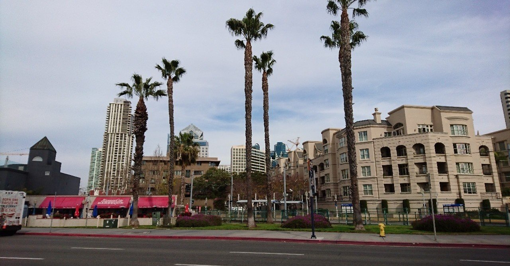
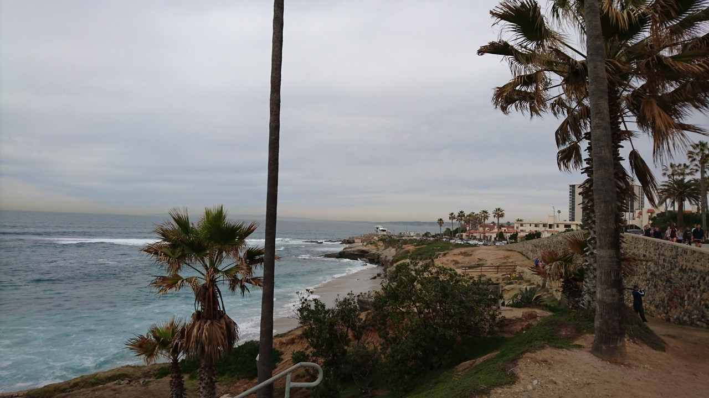
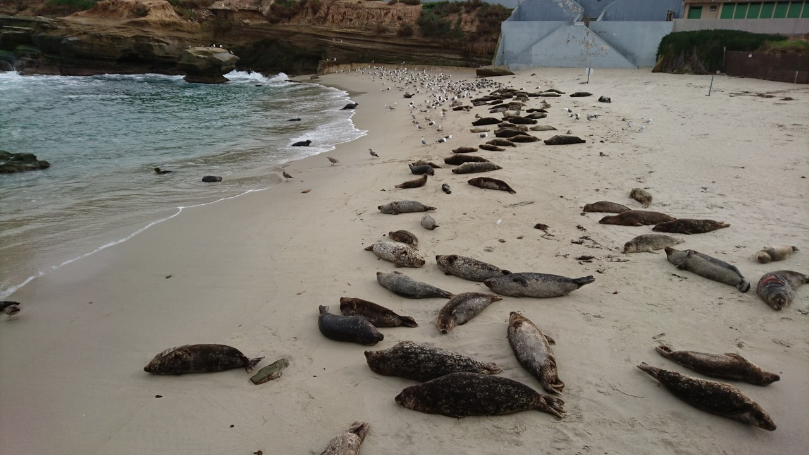
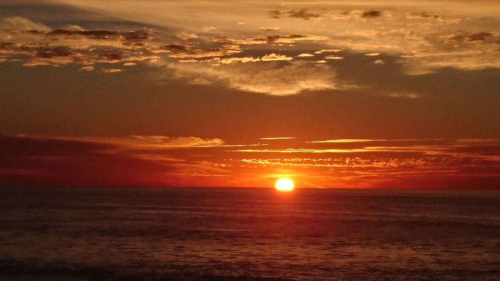

# [海外渡航・第24回] San Diego / U.S.A (2016年1月27日〜1月31日)

海外渡航の備忘録を新しい順に作成中。

2015年に引き続き、巨大半導体ベンダーに出張。先方エンジニアとのテクニカル・ディスカッションだったけど、準備不足もあって、稀に見るボロボロ状態（涙）

## La Jolla (ラ・ホーヤ)

サンディエゴの高級住宅地。そして観光地の一つ。海、絶景でした。

海岸に寝そべる無数のあしかの生で、獣匂すごかったですけど。

写真の海の向こうは日本です。多分w

## Uber初体験:何もかもが便利だ

公共交通機関が異様なくらい未発達な街。これがなかったら、ラホーヤには行けなかったのは間違いない。

アプリから１クリックで呼び出し。行き先を告げる必要なし。支払いは自動。金額も概ね見積もり通り、ボッタクリなし。ドライバも利用者も評価されるので一定の質が担保されている、はず。来る車のナンバーもわかっている。何もかも便利。

唯一、ピックアップされるまでが課題かな。ドライバから居所を聞かれる電話が何度も鳴ってその応対に右往左往。帰りは夜型で車が見つからず途方にくれた。スマホ電池切れ寸前でピックアップできてギリギリ、セーフ。ここも、解決できる技術がありそうな気がするので時間の問題かもしれない。

## オスプレイ初めて見た

オスプレイの形してた（笑）慌ててたんで写真は、ない。

