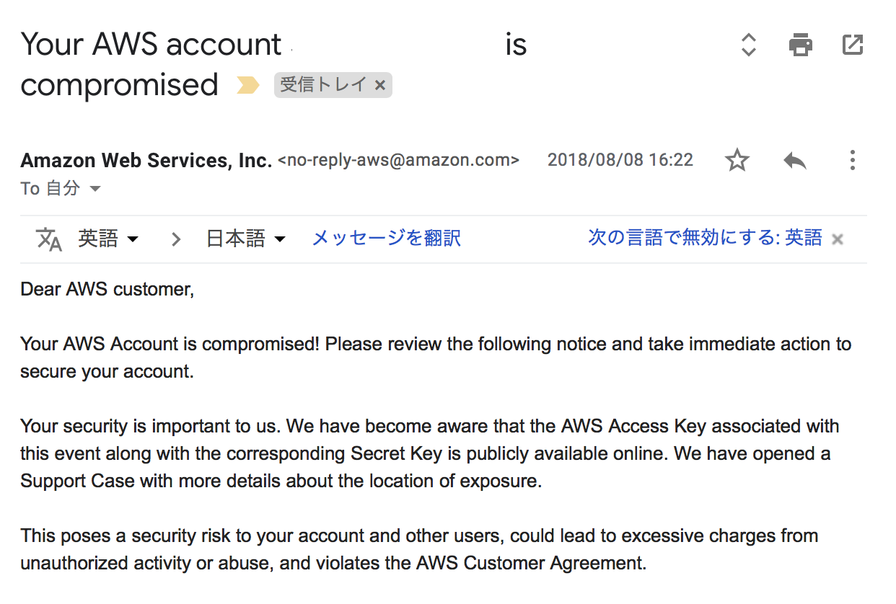
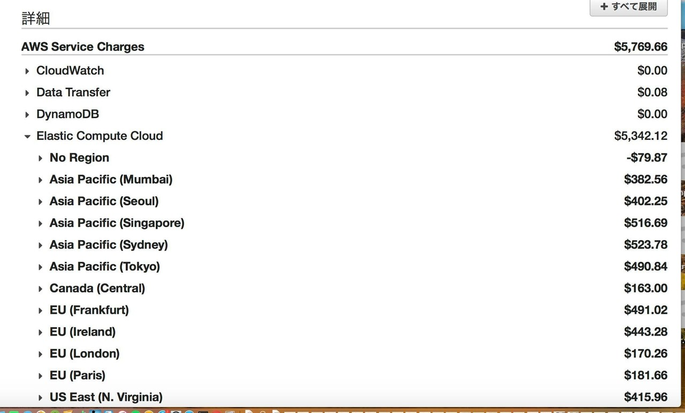
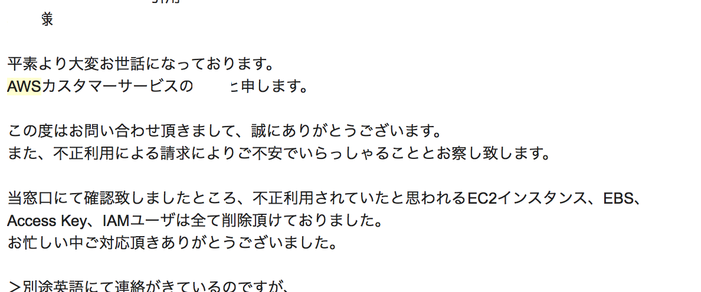
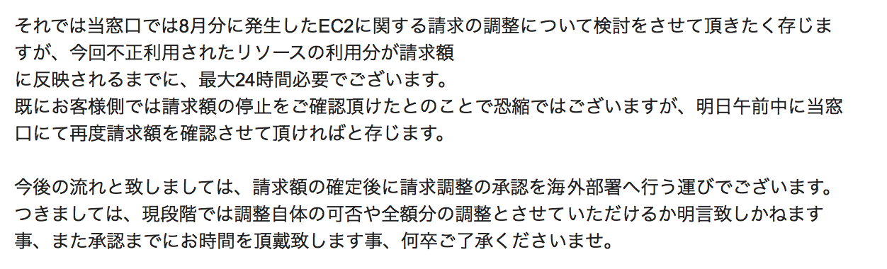

# AWS請求額5千ドル : アカウントのセキュリティ設定は「絶対に」端折るな

強力なクラウドコンピューティング環境、Amazon Web Service (通称AWS)。私も、個人でやっているスマホアプリやウェブサービスの開発で、力いっぱい利用している。

そのAWS のセキュリティ、特にアカウントのセキュリティの設定は「ぜーーーったいに」サボることなく、きちんとやりなさい、というお話です。

## 「むき出し」状態のアカウント取得直後

AWS の強力でかつ豊富なコンピューティングサービス。これらは、メールアドレスとパスワードを登録するだけで利用できてしまう。これは、家のいくつもある部屋や金庫のが、「たった一つ」鍵でだれでもあけられてしまう状態、ということだ。それを盗まれる、つまりアカウントをハックされると、誰でも何でも利用できてしまう。なんとも心もとない状況なのだ。

そこで、AWS は、アカウント取得後のセキュリティ強化のための追加設定を行うように案内している。カンタンに言うと、この唯一の何でもできる「ルートアカウント」は使わず、その代わり、よりきめ細かいセキュリティ設定ができる「IAM ユーザアカウントとグループ」を作成して、そちらで利用しなさい、というものだ。具体的には次のようなものにになる。

1 . 二段階認証 : 鍵を複数個持つ
2. IAM ユーザの作成
3. セキュリティグループの作成
4. ルートアカウントキーの削除

そして以降、ルートアカウントは決っして使わないように推奨。

アカウント取得直後の方、これまでルートユーザを使いつづけてこの対応がまだの方、

## 「今すぐ」セキュリティ強化を「絶対に」やる！

以下の記事に手順も含め詳細が記載されているので、参考にするとよい。

    
[AWSアカウントのセキュリティ設定を実施 - KayaMemokayakuguri.github.io](http://kayakuguri.github.io/blog/2015/04/24/aws-account-security/)
        
[AWSアカウントを取得したら速攻でやっておくべき初期設定まとめ - Qiita[AWSアカウントを作成](http://aws.amazon.com/jp/register-flow/)したら最初にやqiita.com](https://qiita.com/tmknom/items/303db2d1d928db720888)
    
## セキュリティ強化を「サボると」どうなるか

上に書いた施策、実は結構手間。そして、普段の利用で、サービス利用毎にIAMを丁寧に設定して、というのは実は案外面倒くさい。なので、ついついルーズになってしまった方も多いだろう。「ちょっとくらいカギかけなくても、泥棒さん入ってこないさ」と、思う瞬間があるかもしれない。そんな方に、私が被った実話を届けておきたい。

## 請求額5千ドル

こんな請求の通知メールをを見た瞬間を想像してほしい。

それは、AWS Lambda を使ったウェブサービスを作ってgithub にソースコードをコミットした次の日。所属するビッグバンドのライブ本番に向かう電車の中でのことだった。

"Your AWS account xxxxxxxxxx is compromised" という件名の、次のようなメールが。

"Compromised" って「易感染性」なんて意味だそうだが、そんなものわからなくても、ぞ〜〜っとするのに十分な文面。慌ててBilling の請求書を見たら、次のような画面に！

主にEC2. 最も高いインスタンスを、不正利用に気づくまでの３日間、使われ放題。その利用額、合計5,300USD余り。

（注 : 上記のの画面は「最終請求額」。この時点では5,300 ドルでした）

やべ、やっちまった、どうしよう。。。実は、すぐに、前日にやらかしたことが浮かんだのでした。

## 
すべては、自分の不注意と怠惰

やっちまったことは、このようなもの。

・ルート権限を持つIAMユーザーを作成 
・その認証情報をソースコードにハードコート 
・そして、そのソースコードをgithubにアップし公開

↑↑、ほとんどの方にとっては宇宙語でしょうから、 AWSを存じない方にもわかるように言い換えると、多分こんな感じ。

・家中全ての扉や金庫を解錠できる一つのカギを作成
・そのカギに家の住所を書いた札をつけて
・目に付く、誰でも持っていけるところにそのカギを置きざりにした

...要するに「アホ」です（苦笑）

利用料 1.5USD/h の "c4.8xlarge"とかいうインスタンス（仮想サーバ）を世界中の全リージョンで総計200個（数えてませんけど）くらい大量に作られてしまい力一杯稼働させていました。ビットコインの採掘でもしてたんでしょうか。

## で、どうしたか

上のメールやネットの情報を参考に、慌ててやったのが、以下。

・パスワードを変更
・IAM のアクセスキーをすべて削除
・EC2 インスタンスをすべて削除
・github のソースコードを削除

ここまですれば、だれも何もできなくなる、、はず。さらに、

で、そして、即AWSのサポートに連絡、と、ふと気づく。

なんと土曜日！サポート、お休み。月曜日まで待たなくてはならないとは。

仕方ないのでサポートのページより投稿も。そして、これまで「ベーシック」だったサポートプランを、24時間以内の返答がおそらく保証されている「デベロッパ」に変更。

余談だけど、ここまでの対応、実はライブ本番前の控室で実行（苦笑い）。

そして、何もできないまま、間違いなく被害は止まったかを確認しするため再度Billing のページを見たら、、増えてる！$5,300 から$5,700 に、、、どうしよう。まだはっくされてるのか？

よくよく調べたら、金額確定は利用後の24時間後、ということで、次の24時間後に金額が変わってなければオッケーということ。いやこの瞬間は、ホンマに心臓をわしづかみにされた感じでした。

## 前例、多すぎ（苦笑）

気になりながらも演奏しきったライブ。そして、「待つしかない」日曜日。対処方法を調べるためにググったところ、まぁ、なんと前例の多いこと、多いこと。

"AWS 不正利用 高額" と検索窓に入力したら、山ほど事例が出てくる。請求額8万ドルとかいう強者も。それこそ、生きた心地しなかったがしなかっただろう。世の中、どんだけルーズなヤツ多いんだか。

そして、食いつくように事例を２０個くらい調べたところ、そのどれもが結局支払いを免除され、実際に支払った例は皆無。それがわかって、ちょっとだけ安心したのが、ホンネ。

## AWS サポートは「神」だった

で、月曜日夕方。待ちに待ちかねた第一報が、これ。

いやー神だわ。心情までわかってくださって。もっとも、「またかよ」と舌打ちしながらのサポートかもしれませんけど（苦笑

そして、メールの続き。

「請求の調整」というのが、要するに、「不正利用であることが認められて支払い免除される」ということ。。。でしょう。。。ね。。。きっと。

以降、概ね一日一度のやりとりながら、不正使用であることが認められ、10日後あたりに全額免除に。上の請求書の数字も、すっきりと「ゼロ」に。

いや、AWS のサポート担当さん、お手数をおかけしました！

## 心理状態のエアポケット

じゃ、なんでこんなアホなことをしてしまったのか、を振り返ってみると、

「開発時に思った通りに動かなくてカリカリしていたので、ついついセキュリティ設定をゆるくして動作確認をし、その後やらなくてはならないことをすっかり端折ってしまった」

ということになる。

一応言っておきますと。 ソフトウェア開発は、プロ。こう言った類のセキュリティには 普段から気をつけているつもりでは、いる。

 ただ、この時は、時間が限られた中でウェブサービスを作っていて、うまくいかないのでカリカリしながら、本来やらなくてはならない

・キーなどの認証情報は環境変数などに落とし込みソースコードから分離する
・githubに公開する時は認証情報などの記述がないかチェックする
(git secret とかいう、認証情報をcommit しないようにするツールがあるらしい)
・全権を持つIAM ユーザは基本作成しない

こう言った、やるべきだと正気のときはわかっていることをことを全て端折った結果、であるといえよう。

## 教訓 : 面倒だからと言って安全を犠牲にしてはなりません

カギかけるの面倒だから、短時間だからいいか、と言ってカギかけないで出かけたら、そりゃ、結果は自明ですわね。

## さいごに

しばらくのほとぼりの後、以前のように、個人のスマホアプリやウェブサービスを再開。

で、この件の収支。

ギャンギャン泣きついて結局不正利用分は全てチャラにしてもらい、実質被害額はゼロに。費用発生は、サポートレベルを上げて発生した20ドルのみ。

そして、いい薬になった、語るネタが一つ増えた、という体験から得たもの。

しかし、発覚してからその間の二週間弱、飯も喉を通らんほどの日々を過ごさざるを得ない、とんだお盆休みになってしまった、その損害は計り知れない。

言うまでもなく、こんなものは二度と味わいたくない。もう一度言っておこう。

## AWS アカウントのセキュリティの設定は「ぜーーーったいに」サボることなく、きちんとやりなさい。

最後まで読んでいただきありがとうございました。

