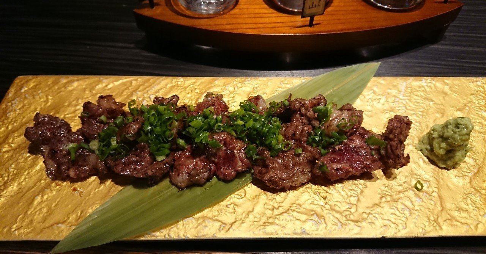

# IoT : アニマルウェルフェア

一見、IoT ネタとは関係なさそうだけど、畜産業はIoTの「超」有力なユースケース。IoT技術で対応したい課題のひとつ「アニマルウェルフェア」について。

アニマルウェルフェアとは

直訳すると「動物福祉」。人類の有史以来お世話になっている家畜が、より健康的に、「らしく」生活ができるようにする畜産の在り方のこと。ここに詳しい。

具体的には？

ケージ飼育されている鶏を、放し飼いにして繋がれている牛や羊を放牧して動きの自由を与える、といったもの。自分の体の幅ほどしかないケージに何百羽も収納されている養鶏場、鶏はそりゃシンドイに違いないですわね。

なんでやるのか？

放し飼いの鶏が生んだ卵は絶品、という話を聞いたことがあるかもしれない。ただ、家畜に自由を与えてストレスなくすごせるようにしたら、美味い卵や肉ができるかというと、ぼちぼちその関連性が実験でわかったという報告がある程度で、実証までは至っていない。

じゃ、なんでか、というと、経済性とかお味とかそういうことではなく、ひとことでいうと、「そうあるべきだから」。

家畜とはいえ、人間の都合のよいように扱ってはよくない。人間は、動物を殺してその肉などをいただいています。なので、その家畜に対しては、飼育している過程で不自由さや苦痛を与えることなく、動物が本来持っている行動が発揮できる環境で、飼育すべきでは、という「あるべき姿」を「道義的に」という考え方。

その取り組み

一番進んでいるのは、ヨーロッパ。さきほどの例のケージ飼いの鶏も、ある種のケージの使用は2012年に全面禁止。そのほか、去勢とか、いくつも、これまで人間の都合で家畜に強いてきたことを禁止している。

また、外食産業でも、自社で取り扱う食品には、アニマルウェルフェアを配所したものを積極的に使うなどの取り組みがみられる。

で、日本は？

想像がつくだろう。遅れてます。てか全然取り組めてません。

鶏のケージも一切制約なし。

ただ、難しいのは、ヨーロッパでやっているからといって、ハイ日本も、というわけにはいかないところ。

日本は、生卵を積極的に食べる習慣がある。ケージ飼いを一切禁止し、すべてを放し飼いにしたら、サルモネラ菌だらけでとてもじゃないけど衛生面での維持ができないらしい。食習慣は国の文化に根差したところもあるので、そのまま、というわけにはいかない。

そこは考慮しなくてはならないんだけど、日本が遅れてるな、と思うのは、教育。

アニマルウェルフェアって、知ってましたか？

おそらく知らない人が多いだろう。酪農家、養鶏など畜産業の方々でも半分くらいしか認知度がないらしい。まずはそこから、なのかもしれない。

