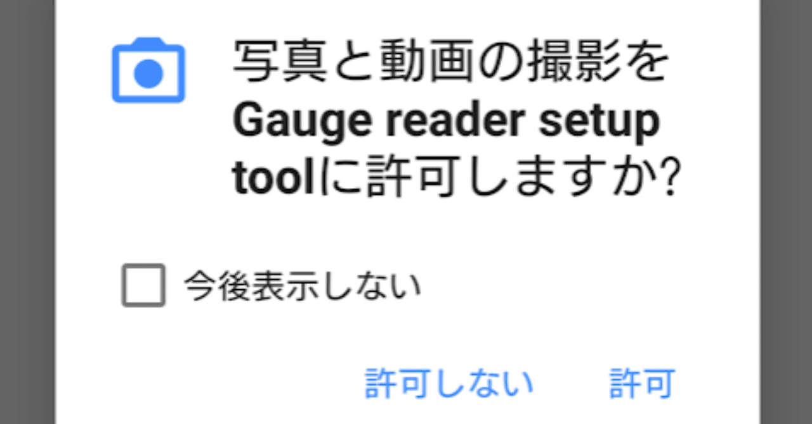

# ”PermissionDispatcher”でAndroidパーミッションをラクに実装！

Androidアプリにて、端末の様々な情報へのアクセスや機能の利用をユーザーに伝え、そのアクセスや機能の許可を促すための仕組み、「パーミッション」。

ストレージ、カメラ等にアクセスするアプリは、このパーミッション機能を必ず実装する必要があります。で、そのパーミッション機能、ベタで書いたら、案外コード量が多く複雑なものになりがちなのですが、"PermissionDispatcher" というライブラリを使うと、カンタンに実装できることができます。
カメラ・外部ストレージ書き込みのパーミッション実装

Android アプリで頻出しそうなケースであること、そしてkotlinでいいサンプルが見当たらなかったのカメラ(android.permission.CAMERA)と外部ストレージ書き込み(android.permission.WRITE_EXTERNAL_STORAGE) のパーミッションチェックをPermissionDispatcher で実装しました。

[https://github.com/rochefort8/PermissionCheck-android-sample](https://github.com/rochefort8/PermissionCheck-android-sample)

詳細記事はこちらよりどうぞ。

[https://qiita.com/rochefort8/items/684b4f2541ca4036828a](https://qiita.com/rochefort8/items/684b4f2541ca4036828a)

