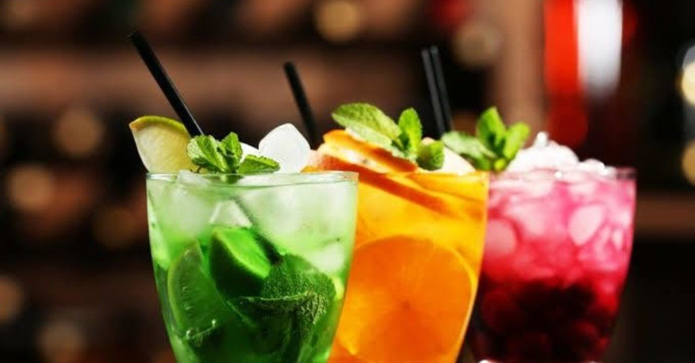

# 「脳」面白いな〜

だいぶ前から知ってはいた「なんとか効果」。その「なんとか」をど忘れして調べたついでの備忘録。

## プラシーボ効果

有効成分がないはずの薬を「効く」と思いながら服薬すると、所望の症状の改善が見られること。「偽薬効果」ともいうらしい。脳が痛みを感じるときに分泌される「エンドルフィン」という物質が、薬を効くと思っている患者にはより多く分泌されることが実験でわかっているとのこと。

逆に、「副作用があるかも」と思いながら薬を投与すると、実際にその懸念していた副作用が現れやすい、というのは、「ノシーボ効果」と言うらしい。

「病は気から」「笑う門には福きたる」とは昔から言うけど、単なる気持ちや日頃の心がけの話にとどまらず、実際に作用しているのが医学的にわかった、というのが、興味深い。

## カクテルパーティー効果

自分の興味のあることだけを拾って聞き取ることができること。カクテルパーティーのように、周囲が雑然と騒がしい中、自分の名前が呼ばれたら反応できるように、人は、周囲の音から、必要な情報だけを選んでいることがわかる。

これ、本来は、音に対しての話なんだけど、もっと広げて、

「人は、周囲の状況から、自分の関心のあることを選んで反応することができる」逆にいうと、
「人は、周囲の状況で、自分に関心のないことは気づかない」

とも言えないだろうか。

そういえば、妻の妊娠がわかった直後、通勤電車や街中で突然やたら妊婦さんが目について「世の中、こんなに妊娠している方が多いのか」と驚いたことがある。
ある日突然、妊婦さんが増えるわけは、ない。
ある日突然、自分ごとになって関心が現れたに違いない。

さらに、そのお腹の中の子が産まれた直後、大きなベビーカーにヤツを乗せて、出産祝いでもらったホテルのレストランに行ったら、まぁ世の中、段差が多いこと多いこと。
ある日突然、段差が増えるわけは、ない。
これも、ある日突然、自分ごとになったということだ。

